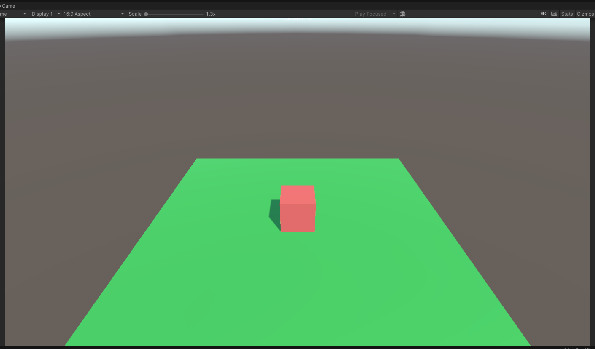

# Doofus Adventure Game

## Overview

Doofus Adventure is an exciting Unity 3D game where players guide Doofus, a cube character, across disappearing platforms called Pulpits. The goal is to survive as long as possible by moving to new Pulpits before the current one vanishes.



## Features

- Dynamic platform (Pulpit) generation and destruction
- Timer-based gameplay mechanics
- Score tracking
- JSON-based configuration for easy customization

## Getting Started

### Prerequisites

- Unity 2022.3 or later
- TextMeshPro package

### Installation

1. Clone the repository:
   ```
   git clone https://github.com/chiragsingh1711/Assignment-HitWicket
   ```
2. Open the project in Unity.
3. Ensure the TextMeshPro package is installed (Window > Package Manager).

### Configuration

The game's parameters are configured in `StreamingAssets/doofus_diary.json`. Modify this file to adjust:

- Player speed
- Pulpit spawn and destruction times

## How to Play

- Use WASD or arrow keys to move Doofus.
- Jump to new Pulpits before the current one disappears.
- Aim for the highest score by surviving as long as possible.

## Project Structure

- `Scripts/`
  - `GameManager.cs`: Main game logic
  - `Pulpit.cs`: Individual platform behavior
- `Prefabs/`
  - `Doofus.prefab`: Player character
  - `Pulpit.prefab`: Platform object
- `StreamingAssets/`
  - `doofus_diary.json`: Game configuration file
